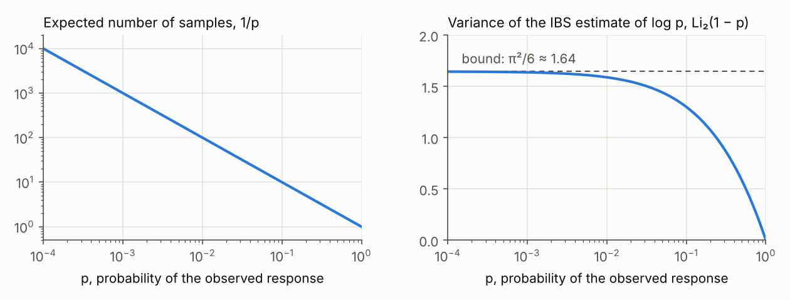

*****
PyIBS
*****

PyIBS is one of the open-source `tools for fitting models to data <https://acerbilab.org/model-fitting/>`__ developed by `Luigi Acerbi's group <https://www.helsinki.fi/en/researchgroups/machine-and-human-intelligence>`__ at the University of Helsinki. It works with `PyBADS <https://acerbilab.github.io/pybads/>`__ for point estimates and `PyVBMC <https://acerbilab.org/pyvbmc/>`__ for posterior and model-evidence estimates.

What is it?
###########

PyIBS estimates the log-likelihood of a model that you can simulate but whose likelihood you cannot compute. It implements inverse binomial sampling (IBS) for data with discrete responses [`1 <#references>`__]. For each trial, IBS simulates responses until one matches the observed response, then uses the number of draws to estimate that trial's log-likelihood. Without a likelihood threshold or time limit, the estimate is exactly unbiased. PyIBS also estimates its variance, which measures the noise introduced by simulation. The reference implementation is ``ibslike.m`` in :labrepos:`MATLAB IBS <ibs>`.

Use the estimates with a method that handles noisy objectives: `PyBADS <https://acerbilab.github.io/pybads/>`__ for maximum-likelihood or maximum-a-posteriori estimation, or `PyVBMC <https://acerbilab.org/pyvbmc/>`__ for posterior and model-evidence estimation. PyIBS can return the estimate and its estimated standard deviation in the format both methods accept. These packages are among the lab's `tools for fitting models to data <https://acerbilab.org/model-fitting/>`__.

What's new in PyIBS 1.5
-----------------------

- **Rebuilt and checked against MATLAB IBS.** The sampling code follows
  ``ibslike.m`` 0.96 and has been compared with it line by line. The
  :mainbranch:`catalogue of deliberate differences <pyibs/README.md>`
  explains the choices made for the Python implementation.
- **Validated against exact likelihoods.** Tests on 16 models with exact
  log-likelihoods detected no bias. The
  :mainbranch:`validation record <dev/results/2026-10-09-validation.md>`
  lists the models and settings tested, and the limits of the variance
  estimates.
- **Ready for PyBADS and PyVBMC.** ``additional_output="std"`` returns a
  tuple of Python floats: the estimate and its estimated standard
  deviation. PyBADS 1.5 and PyVBMC 1.5 accept this format for noisy targets.
  PyIBS warns when the standard deviation is 0, which both methods refuse,
  and links to
  :ref:`guidance in the FAQ <faq-why-is-the-sd-of-the-estimate-zero-and-why-do-pybads-and-pyvbmc-refuse-it>`.
- **Reproducible runs.** ``IBS(..., random_seed=...)`` seeds a random number
  generator that the simulator receives through its ``rng`` parameter. Set
  the sampling schedule explicitly to avoid a decision based on timing;
  see :doc:`Getting started <quickstart>`.
- **Fixes.** PyIBS 0.1.0's default ``max_iter`` was 15, which biased
  estimates for improbable responses. It also failed on responses with
  several columns. Version 1.5 fixes these and other defects.
- **Faster.** In
  :mainbranch:`timings of the example model <dev/results/2026-10-09-validation.md>`,
  PyIBS 0.1.0 took 1.3 to 2.1 times as long per estimate with a fast
  simulator, and up to 3.8 times as long when a fixed cost per simulator
  call dominated the runtime.
- **Requirements.** PyIBS requires Python 3.10 or later. Its only runtime
  dependencies are NumPy 2.0 or later and SciPy 1.13 or later.
- **Documentation and examples.** The documentation includes three
  :doc:`example notebooks <examples>` covering basic use, PyBADS, and
  PyVBMC, plus a :doc:`FAQ <faq>`. The
  :mainbranch:`PyIBS skill <skills/pyibs/SKILL.md>` helps coding agents
  find the relevant documentation. To use it, give the file to your coding
  agent or copy the ``skills/pyibs`` folder into its skill directory.
  Update a copied skill from the PyIBS version you use.

Results differ from PyIBS 0.1.0 even with a fixed seed, and ``IBS`` rejects
some settings that the earlier version accepted. Before upgrading an
existing analysis, read "Upgrading from 0.1.0" in the
:mainbranch:`changelog <CHANGELOG.md>`, which also lists the changes in
detail.

How does it work?
-----------------

Suppose a trial's observed response has probability :math:`p` under the model. IBS does not need to know :math:`p`: it simulates responses until one matches, taking :math:`K` draws, and estimates :math:`\log p` as

.. math::

   \hat{L} = -\sum_{k=1}^{K-1} \frac{1}{k}.

The estimate is 0 when :math:`K = 1`. For every :math:`p > 0`, it is exactly unbiased and has the least variance among unbiased estimators based on this sampling procedure. Its variance is bounded by :math:`\pi^2/6` even as :math:`p` approaches 0 [`1 <#references>`__, Sections 2.4 and 4.3]. The same count :math:`K` gives an estimate of that variance, :math:`\psi_1(1) - \psi_1(K)`, where :math:`\psi_1` is the trigamma function [`1 <#references>`__, Section 4.3]. Its expectation is the variance itself, :math:`\operatorname{Li}_2(1 - p)` (Fig 1), so the variance estimate is unbiased too.

Summing over trials and averaging independent repeats often makes the
estimated standard deviation useful for normal confidence intervals
[`1 <#references>`__, Section 4.6]. This approximation is not reliable for
every model or number of repeats. For example, if every response matches on
its first draw, the variance estimate is 0 even when repeated IBS calls can
vary. The
:mainbranch:`validation record <dev/results/2026-10-09-validation.md>`
examines these limitations.

Fig 1: A trial with matching probability :math:`p` takes :math:`1/p` samples on average (left). The variance of its :math:`\log p` estimate, :math:`\operatorname{Li}_2(1 - p)`, stays below :math:`\pi^2/6` even as :math:`p` approaches 0 (right) [`1 <#references>`__, Sections 4.2 and 4.3].

The data's log-likelihood is the sum of the trial log-likelihoods. IBS
therefore adds their estimates and variance estimates. An ``IBS`` call
averages ``num_reps`` independent repeats, reducing the variance by that
factor. Each simulator call samples all trials that still need a match.
With ``vectorized=True``, it requests several samples per trial, a number
that grows after every call.

The optional likelihood threshold, ``neg_logl_threshold``, stops a repeat
once its accumulating negative log-likelihood estimate exceeds the
threshold. That repeat contributes the threshold value to the negative
log-likelihood estimate. This saves simulation at poor parameters but biases the estimate
[`1 <#references>`__, Appendix C.1]. A finite ``max_time`` also biases
estimates; use neither limit when unbiasedness is essential.

See the IBS paper for more details (`van Opheusden, Acerbi and Ma, 2020 <#references>`__).

When should I use PyIBS?
------------------------

Use PyIBS when you can simulate a model's responses but cannot compute its likelihood. The responses must be discrete, such as choices, categories, or counts, and the simulator must be able to draw each trial's response given its context: its stimulus and, when relevant, earlier stimuli and responses [`1 <#references>`__, Section 2.2]. IBS then supplies the noisy log-likelihood and uncertainty estimates needed for maximum-likelihood or maximum-a-posteriori fitting with PyBADS, posterior and model-evidence estimation with PyVBMC, and model comparison.

- **Use a tractable likelihood when available.** The IBS paper recommends
  a closed form or an analytical or numerical approximation whenever one is
  practical. IBS estimates can help check its implementation, and the
  accuracy of an approximation [`1 <#references>`__, Section 6.4].
- **Amortized simulation-based inference is often better when fitting one
  model to many datasets with cheap simulations.** A neural network trained once on
  simulations can share that training cost across datasets. In neural
  posterior estimation, it then estimates the posterior for each new
  dataset almost immediately
  [`3 <#references>`__].
- **IBS remains the method of choice when trial contexts are numerous and
  richly structured.** An amortized estimator must learn the model's
  behaviour across the contexts it may encounter; IBS only simulates the
  contexts present in the data. For example, a model of human board-game
  play chooses each move from the current board position, which may occur
  only once in the dataset [`1 <#references>`__,
  Section 5.4; `2 <#references>`__].
- **IBS also helps when guarantees for each dataset matter.** An amortized
  estimator can be accurate on some datasets and unreliable on others, so
  each dataset needs diagnostics, and a fallback for the datasets that fail
  them [`3 <#references>`__]. IBS requires no training and gives unbiased
  log-likelihood and variance estimates for any dataset when all observed
  responses have positive probability, sampling runs to completion, and no
  call is discarded or kept for its outcome.
  These guarantees concern the likelihood estimates: optimization and
  posterior approximation still introduce errors that need their own
  checks. An estimated standard deviation also need not give accurate
  normal confidence intervals; see `How does it work? <#how-does-it-work>`__.
- **Account for the cost of improbable responses.** A trial whose observed
  response has model probability :math:`p` takes :math:`1/p` samples on
  average. A lapse component that gives every possible response positive
  probability limits this cost. The likelihood threshold can save work at
  poor parameter vectors, at the cost of bias [`1 <#references>`__, Sections
  2.2 and 6.4, Appendix C.1]. Continuous responses require binning or an
  approximate matching rule [`1 <#references>`__, Section 6.3]; see the
  :ref:`FAQ <faq-can-i-use-ibs-with-continuous-responses>`.

The FAQ discusses
:ref:`IBS and amortized simulation-based inference <faq-when-should-i-use-ibs-rather-than-amortized-simulation-based-inference>`
in more detail.

How-to
######

.. toctree::
   :maxdepth: 2
   :titlesonly:

   installation
   quickstart
   faq
   examples
   documentation

Contributing
############

.. toctree::
   :maxdepth: 1
   :titlesonly:

   development

References
##########

1. van Opheusden, B.\*, Acerbi, L.\* & Ma, W. J. (2020). Unbiased and efficient log-likelihood estimation with inverse binomial sampling. *PLOS Computational Biology* 16(12): e1008483. (\* equal contribution) (`paper <https://doi.org/10.1371/journal.pcbi.1008483>`__)

2. van Opheusden, B., Kuperwajs, I., Galbiati, G., Bnaya, Z., Li, Y. & Ma, W. J. (2023). Expertise increases planning depth in human gameplay. *Nature* 618: 1000-1005. (`paper <https://doi.org/10.1038/s41586-023-06124-2>`__)

3. Li, C., Vehtari, A., Bürkner, P.-C., Radev, S. T., Acerbi, L. & Schmitt, M. (2026). Amortized Bayesian workflow. *Transactions on Machine Learning Research*. (`paper on OpenReview <https://openreview.net/forum?id=osV7adJlKD>`__)

Please cite reference 1 when using PyIBS. For example:

    We estimated the log-likelihood of our models with inverse binomial sampling (IBS; van Opheusden, Acerbi and Ma, 2020), implemented in PyIBS. IBS simulates responses until each observed response is matched, giving unbiased log-likelihood and variance estimates when sampling is allowed to complete.

BibTeX
------
::

  @article{vanopheusden2020unbiased,
    title={Unbiased and efficient log-likelihood estimation with inverse binomial sampling},
    author={van Opheusden, Bas and Acerbi, Luigi and Ma, Wei Ji},
    journal={PLOS Computational Biology},
    volume={16},
    number={12},
    pages={e1008483},
    year={2020},
    publisher={Public Library of Science},
    doi={10.1371/journal.pcbi.1008483}
  }

License and source
------------------

PyIBS is released under the terms of the :mainbranch:`BSD 3-Clause License <LICENSE>`.
The Python source code is on :labrepos:`GitHub <pyibs>`.
Explore `PyBADS <https://acerbilab.github.io/pybads/>`__, `PyVBMC <https://acerbilab.org/pyvbmc/>`__, the original :labrepos:`MATLAB IBS toolbox <ibs>`, and the lab's other `tools for fitting models to data <https://acerbilab.org/model-fitting/>`__ for related software.

Acknowledgments
###############

PyIBS is developed by members (past and current) of the `Machine and Human Intelligence Group <https://www.helsinki.fi/en/researchgroups/machine-and-human-intelligence>`__ at the University of Helsinki and `ELLIS Institute Finland <https://www.ellisinstitute.fi/>`__. We thank Julia Maria Perathoner for her work on PyIBS 0.1.0, an earlier Python port of IBS. Development of PyIBS 1.5 was assisted by coding agents, including Anthropic's `Claude <https://www.anthropic.com/claude>`__. Work on the PyIBS package is supported by the Research Council of Finland (grants 356498 and 358980 to Luigi Acerbi) and its Flagship programme: `Finnish Center for Artificial Intelligence FCAI <https://fcai.fi/>`__.

.. toctree::
   :maxdepth: 1
   :titlesonly:
   :hidden:

   about_us
